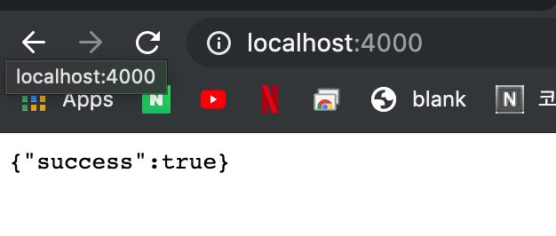

# Full stack Node with React 0 to Deploy

`/server` 디렉토리를 생성하고 `npm init`을 한다.

```bash
npm init -y
```

`package.json`에 따라 main인 `index.js`를 생성한다.

```json
{
  "name": "server",
  "version": "1.0.0",
  "description": "",
  "main": "index.js",
  "scripts": {
    "test": "echo \"Error: no test specified\" && exit 1"
  },
  "keywords": [],
  "author": "",
  "license": "ISC"
}
```


```bash
npm install --save express morgan cors axios
```


```bash
npm install --save-dev nodemon
```


```json
 },
  "scripts": {
    "start": "nodemon index.js"
  },
  "devDependencies": {
```


```javascript
const express = require("express");
const morgan = require("morgan");
const cors = require("cors");
const axios = require("axios");
const app = express();

app.use(express.json());
app.use(morgan("dev"));
app.use(cors());

app.get("/", (req, res) => {
  res.json({ success: true });
});

app.listen(4000, () => {
  console.log("listening on PORT 4000");
});
```

`npm start`로 서버를 시작하면 아래와 같이 성공 메세지를 볼 수 있다.



이제 클라이언트를 구성한다. 

```bash
npm install create-react-app
create-react-app client
```


`App.js` 를 다음과 같이 변경한다.

```javascript
import React from "react";
import logo from "./logo.svg";
import "./App.css";

function App() {
  const [people, setPeople] = React.useState([]);

  async function getPeople() {
    const res = await fetch("http://localhost:4000/");
    const resData = await res.json();
    setPeople(resData);
  }
  return (
    <div className="App">
      <header className="App-header">
        
        <div>
          <h1>React & Node People Fetcher</h1>
          <input
            style={{ fontSize: "2rem" }}
            palceholder="Number of people"
            type="number"
          />
          <button style={{ fontSize: "2rem" }} onClick={getPeople}>
            Submit
          </button>
          {JSON.stringify(people)}
        </div>
      </header>
    </div>
  );
}

export default App;
```


데이터를 받아와서 패치

```javascript
import React from "react";
import logo from "./logo.svg";
import "./App.css";

function App() {
  const [count, setCount] = React.useState(0);
  const [people, setPeople] = React.useState([]);

  async function getPeople() {
    const res = await fetch(`http://localhost:4000/?count=${count}`);
    const resData = await res.json();
    setPeople(resData);
  }
  return (
    <div className="App">
      <header className="App-header">
        
        <div>
          <h1>React & Node People Fetcher</h1>
          <input
            style={{ fontSize: "2rem" }}
            onChange={event => setCount(event.target.value)}
            palceholder="Number of people"
            type="number"
          />
          <button style={{ fontSize: "2rem" }} onClick={getPeople}>
            Submit
          </button>
          {JSON.stringify(people)}
        </div>
      </header>
    </div>
  );
}

export default App;

```


```javascript
const express = require("express");
const morgan = require("morgan");
const cors = require("cors");
const axios = require("axios");
const app = express();

app.use(express.json());
app.use(morgan("dev"));
app.use(cors());

app.get("/", async (req, res) => {
  const count = req.query.count || 20;
  const response = await axios.get(
    `https://randomuser.me/api/?results=${count}`
  );
  res.json({ data: response.data.results });
});

app.listen(4000, () => {
  console.log("listening on PORT 4000");
});

```


데이터를 깔끔하게 뿌려주기 위해 다음과 같이 수정한다.

```javascript
import React from "react";
import logo from "./logo.svg";
import "./App.css";

function App() {
  const [count, setCount] = React.useState(0);
  const [people, setPeople] = React.useState([]);

  async function getPeople() {
    const res = await fetch(`http://localhost:4000/?count=${count}`);
    const resData = await res.json();
    setPeople(resData.data);
  }
  return (
    <div className="App">
      <header className="App-header">
        
        <div>
          <h1>React & Node People Fetcher</h1>
          <input
            style={{ fontSize: "2rem" }}
            onChange={event => setCount(event.target.value)}
            palceholder="Number of people"
            type="number"
          />
          <button style={{ fontSize: "2rem" }} onClick={getPeople}>
            Submit
          </button>
          {people.map(person => (
            <div
              key={person.email}
              style={{
                width: "100%",
                display: "flex",
                marginTop: ".5em",
                justifyContent: "space-between",
                alignItems: "center"
              }}
            >
              
              <div>
                <h3>{person.name.first}</h3>
                <p>{person.email}</p>
              </div>
            </div>
          ))}
        </div>
      </header>
    </div>
  );
}

export default App;

```


이제 프로덕트 개발이 끝나고 배포를 할 예정이다. 배포를 위해서는 새로운 환경 설정이 필요하다.

CORS를 위해 origin을 먼저 정한다.

```javascript
const app = express();

const origin =
  process.env.NODE_ENV !== "production"
    ? "http://localhost:3000"
    : " prod-url";

app.use(express.json());
app.use(morgan("dev"));
app.use(cors({ origin }));
```


```javascript

const BASE_URL =
  process.env.NODE_ENV !== "production"
    ? "http://localhost:3000"
    : "prod-backend-url";

ReactDOM.render(<App />, document.getElementById("root"));
```


```javascript
import "./App.css";
import { BASE_URL } from "./index";

function App() {
  const [count, setCount] = React.useState(0);
  const [people, setPeople] = React.useState([]);

  async function getPeople() {
    const res = await fetch(`${BASE_URL}/?count=${count}`);
    const resData = await res.json();
    setPeople(resData.data);
  }
```

