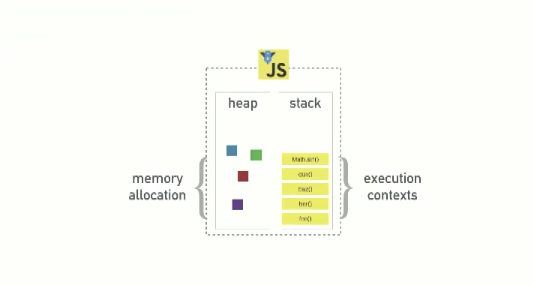
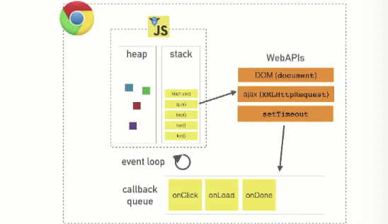
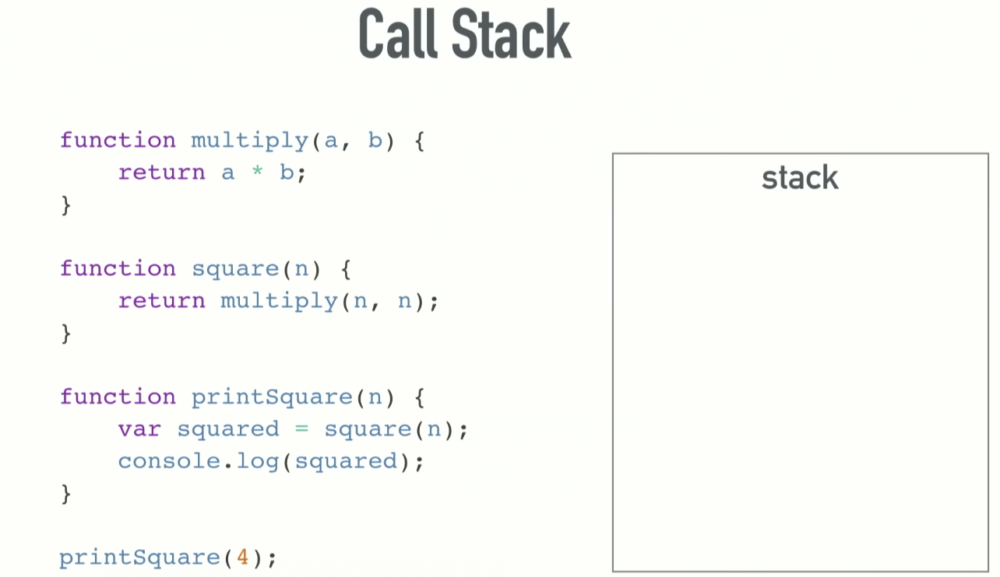
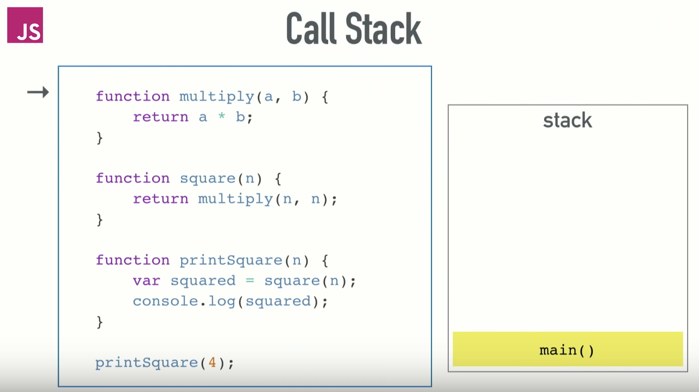

# Javascript - event loop 너란 녀석

Javascript 런타임을 단순화 하면 다음과 같다. 메모리 할당이 일어나는 힙과 콜 스택이 있다. 하지만 실제 로는 아래와 같지 않다.

실제 돌아가는 방식은 아래와 같다. V8런타임과 브라우저가 제공하는 웹 API가 있다. 

자바스크립트는 싱글 스레드 런타임이다. 한 번에 하나의 싱글 콜 스택만을 가지고 있다.

하나의 프로그램은 동시에 하나의 코드만 실행할 수 있다.

콜 스택은 데이터 스트럭쳐로 실행되는 순서를 기억하고 있다. 함수를 실행하려면 스택에 해당하는 함수를 집어 넣게 되는데 함수에서 리턴이 일어나면 스택의 가장 위쪽에서 해당 함수를 꺼낸다. 이것이 콜 스택이 하는일의 전부이다.

