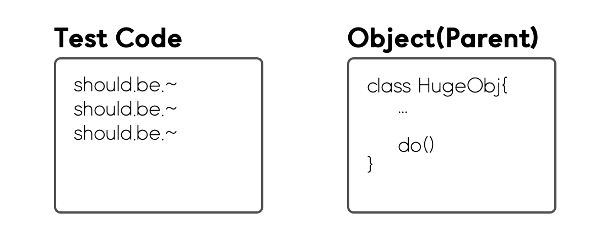
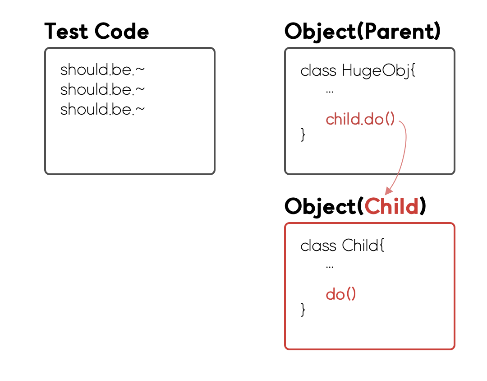
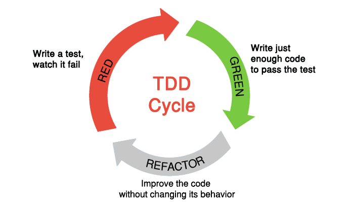

# Javascript TDD - 테스트 작성법(Testing Techniques)

테스트를 작성할 때 다음과 같은 방식으로 작성할 수 있다. 테스트를 작성할 때, 각 상황에 맞게 다양한 접근법을 가지고 테스트를 작성할 수 있다.

* 자식 테스트(Child Test)
* 모의 객체(Mock Object)
* 셀프 션트(Self Shunt)
* 로그 문자열(Log String)
* 크래시 테스트 더미(Crash Test Dummy)
* 깨진 테스트(Broken Test)
* 깨끗한 체크인(Clean Check-in)

 

### 자식 테스트(Child Test)

테스트를 작성하다보면 의도치 않게 테스트 케이스가 커져버리는 경우가 있다. 이러한 큰 테스트 케이스를 돌아가게 만드는 것은 쉽지 않다. 따라서 이를 작게 쪼개어 테스트를 진행하는 편이 좋다.

큰 테스트 케이스를 처음부터 여러 작은 테스트로 쪼개어 작성하는 것이 베스트지만, 그렇지 못한 경우 우선은 큰 테이스 케이스 그대로 돌려본다. 그렇게 테스트를 돌려 깨지면, 깨진 부분에 해당하는 작은 테스트 케이스를 작성하고 그 작은 테스트 케이스를 돌아가도록 만든다. 그리고 다시 원래의 큰 테스트 케이스를 돌아가게 만든다. 이를 **자식 테스트(Child Test)**라고 한다.

자식 테스트의 방식을 이용하여 테스트를 작성하는 과정은 다음과 같다.

1. TDD의 방식으로 테스트 코드를 작성하고 이를 통과하는 코드를 작성하고, 리팩토링을 진행하였다. 그렇게 

2. 

TDD를 할 때는 **빨강 → 초록 → 리팩토링**의 흐름이 끊기지 않는 것이 중요하기 때문에 부단한 노력을 통해 흐름을 유지해야 한다. 이는 자식 테스트를 하는 이유에도 해당한다. 큰 테스트가 실패하였을 때, 흐름을 끊지 않고 바로 깨진 부분을 작은 테스트로 나누어 흐름을 이어가도록 한다.

이와 유사하게, 종종 테스트를 하다보면 새로 작성한 테스트로 인해 앞의 테스트가 실패하는 경우가 발생할 수도 있다. 이런 경우에 흐름을 끊지 않도록 깨진 테스트를 잠시 보류하거나 테스트를 삭제하여 진행하는 것이 좋을 때도 있다. 상황에 맞게 테스트를 진행하여 TDD에서 중요한 빨강 → 초록 → 리팩토링의 흐름을 유지하는 것이 가장 중요하다.

 

### 모의 객체(Mock Object)

데이터베이스 호출이나 네트워킹과 같이 많은 리소스 이용이 필요한 객체에 대한 테스트는 상수를 반환하는 **모의 객체(Mock Object)**를 사용하여 해결할 수 있다.

모의 객체는 테스트하고자 하는 코드(객체 혹은 함수)와 맞물려 동작하는 객체들을 대신하여 동작시키기 위해 만든 객체다. 테스트하고자 하는 코드는 모의 객체의 메서드를 부를 수 있고, 이 때 모의 객체는 미리 정의된 결과 값을 전달한다. 모의 객체는 자신에게 전달된 인자를 검사할 수 있으며, 이를 테스트 코드로 전달할 수 있다.

대다수의 테스트는 진짜 데이터베이스를 사용하지 않고, 마치 데이터베이스인 것처럼 행동하지만 실제로는 메모리에만 존재하는 객체를 이용하여 작성되고 동작한다. 이 덕분에 다양한 변수가 많은 실제 DB서버를 이용하는 것보다 빠르고 정확하게 개발할 수 있으며 견고한 코드를 작성할 수 있게 된다.

또한, 모의 객체는 성능과 견고함 이외에 가독성에서도 장점을 가진다. 모의 객체에 의해 작성된 테스트는 테스트 코드를 읽는 것만으로도 어떤 데이터를 해당 객체에 불러와 작동하게 하는지 한눈에 볼 수 있다.

마지막으로 모의 객체는 코드간의 결합도(Coupling)가 감소하는 방향으로 프로그램을 설계하도록 유도한다. 연관된 클래스가 변경되어도 따로 변경해줘야 할 가능성이 낮아진다는 것을 의미한다. 이는 코드의 재사용성을 높인다.

하지만 이러한 모의 객체가 실제 객체와 동일하게 동작하지 않으면 문제가 발생할 수 있다. 이를 방지하기 위해서는 테스트하고자 하는 코드가 실제 객체와 맞물려 잘 작동할 때 적용해야 문제를 줄일 수 있다.

 

### 셀프 션트(Self Shunt)

Have your object under test communicate with mock objects or test objects (if you’re using xUnit) themselves to test the behavior. It is useful to test delegates and make sure the right messages were sent to a delegate but the object under test.

우선 셀프 션트는 루프백(loopback)이라는 말과 비슷하다. 전선이 자기자신에게 연결되어 있는걸 뜻한다.

한 객체와 다른 객체가 올바르게 소통이 되는지 테스트 하기 위해서는 테스트 대상이 되는 객체와 원래의 대화 상대가 아니라 테스트 케이스와 대화하도록 만들면 된다. 

테스트 케이스가 일종의 모의 객체 노릇을 하게 만든다.

셀프 션트 패턴을 이용한 테스트가 그렇지 않은 테스트보다 읽기에 편하다.

 

### 로그 문자열(Log String)

**Log string.** To test the sequence in which messages are called is correct use a log string. By appending to it the name of the method called you can then assert that your resulting log string is equal to a string that represents the right sequence you’re expecting.

 

### 크래시 테스트 더미(Crash Test Dummy)

Use fake objects to simulate exception edge cases.

 

### 깨진 테스트(Broken Test)

Leave a programming session with a broken test. Sounds counter-intuitive but it will give you a good indication on where to pick up when you get back to coding next time.

 

### 깨끗한 체크인(Clean Check-in)

A bit contradictory to the previous point - when you work in a team leave all of the tests running.